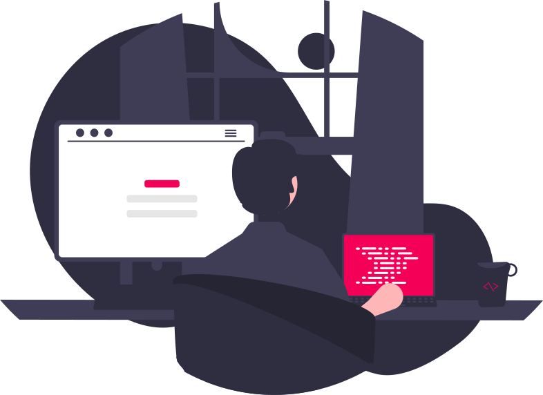

 
  🌎 Olá, meu nome é Deivit Eduardo. Sou <strong>Desenvolvedor Front-End</strong>.

  🧪 Habilidades: <strong>HTML, CSS, JavaScript, Sass, ReactJS, TypeScript e Styled Components.</strong>

  💼 Ferramentas: <strong>VSCode, Figma, Trello, Vercel, Git e GitHub.</strong>

  💌 Você pode entrar em contato comigo aqui ⤵️

  
  
  
  
  

